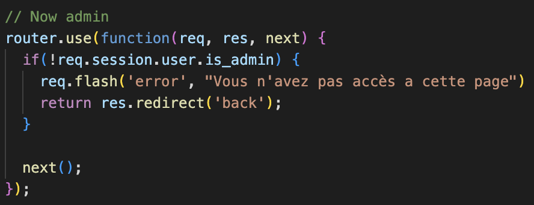

# Liste des failles de sécurité qui auraient pu être exploitées mais ont été sécurisées

## **1. Injection SQL**

### Faiblesse détécté 

L'utilisateur pourrait procéder a des injections SQL en rentrant des valeurs précises dans le champs (ex: `x' or '1'='1`).

### Méthodes de protection

Depuis la création du site, il a été choisi que les requêtes soient paramétrées. Ainsi, les utilisateurs malicieux ne pourront pas utiliser les différentes entrées de texte afin d'injecter du code SQL. Par exemple, il n'est pas possible dans la page de connexion d'utiliser une requête afin de récupérer tous les comptes utilisateurs.

### Stratégie adoptée (début/fin)

Comme évoqué au dessus, les requêtes SQL sont préparés depuis le début. C'est donc une stratégie adoptée au <b>début</b>.

## **2. Cross site scripting (XSS)**

### Faiblesse détécté 

L'attaquant pour rentrer du code JavaScript dans des inputs, et par exemple rediriger les utilisateurs affichant ces valeurs, etc...

### Méthodes de protection

On despécialise les caractères donc il n'est pas possible d'éxecuter de script. Donc si on tappe une instrution JS dans les inputs du site il ne se passera rien. Si un utilisateur rentre un script dans un champ, le script sera seulement affiché comme une chaîne de caractère, pas exécuté.

### Stratégie adoptée (début/fin)

C'est également une stratégie qui a été adopté au <b>début</b>.

## **3. Violation de contrôle d'accès**

### Faiblesse détécté 

Un utilisateur connaissant les adresses de certaines pages pour avoir accès à du contenu non autorisé.

### Méthodes de protection

Afin de contrôler les violations d'URLs, nous avons instauré un middleware s'éxécutant sur l'ensemble des routes. Ainsi, même si un utilisateur connaîtrait une URL qui permettrait d'accéder à des informations auxquels il n'a pas accès, le middleware permettra d'empêcher l'exécution de la route concernée. Nous avons procédé à cette implémentation dès le début car nous avions déjà entendu parler du problème.

### Stratégie adoptée (début/fin)

Cette stratégie a été adopté dès l'implémentation des <b>sessions</b>. C'est donc une stratégie <b>durant</b> le développement.

## **4. Violation de gestion de session**

### Faiblesse détécté 

Un attaquant pourrait récuperer un `sessionId` et usurper l'identité d'une personne, sans avoir a connaître ses identifiants.

### Méthodes de protection

La session est retournée par cookie et non dans l'URL donc il n'est pas possible pour un pirate de recupérer la session d'un utilisateur via une URL volée. 
Le cookie est également encrypté et sécurité via un protocole HTTP. Il n'est donc normalement pas possible pour un attaquant de récuperer le cookie de session.

### Stratégie adoptée (début/fin)

Cette stratégie a été adopté dès l'implémentation des <b>sessions</b>. C'est donc une stratégie <b>durant</b> le développement.

## **5. Chiffrement des données sensibles**

### Faiblesse détécté 

Un utilisateur ayant accès à la base de donnée pour voir tous les mot de passes en clair.

### Méthodes de protection

Afin de protéger les données sensibles, les mots de passes sont stockées sous forme de hash et ne sont donc pas récupérables (cryptage asymétrique). Ainsi, si nous subissons une faille d'accès SQL, les mots de passes seront quand même sécurisés.

### Stratégie adoptée (début/fin)

Le site n'étant pas rendu publique durant le développement, le hashages des mots de passe a été implementé <b>à la fin</b>

## **6. Scripts de redirection**

### Faiblesse détécté 

La redirection s'effectue en fonction de la valeur d'un champ ou d'une donnée renseigné par l'utilisateur.

### Méthodes de protection

Les scripts de redirection essaient d'inclure des URLs malicieuses à l'aide de script JS. Afin de contrer ce problème, nous avons codé toutes nos redirections en dur afin qu'il ne soit pas possible de générer une redirection non contrôlée.

### Stratégie adoptée (début/fin)

Toutes les redirections ont été écrites en dur depuis le <b>début</b> du développement.